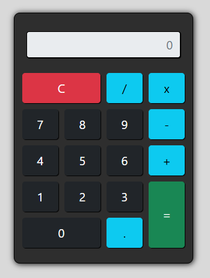

# Calculadora funcional com HTML, CSS e JavaScript! 💻

  

### Desenvolvi esta calculadora interativa usando:

### Este projeto me permitiu aprofundar meus conhecimentos em:

👉Manipulação do DOM, para interagir com os elementos da página. 

👉Event Listeners, para capturar cliques nos botões. 

👉Lógica de programação, para processar as operações matemáticas.

#

"Um desafio interessante foi garantir que a calculadora lidasse corretamente com diferentes operações e exibições."

🟢O resultado é uma ferramenta simples, mas robusta.

[PROJECT__URL]: https://ewefiamoncini.github.io/calculadora/
[PROJECT__BADGE]: https://img.shields.io/badge/📱Visit_this_project-000?style=for-the-badge&logo=project
[![project][PROJECT__BADGE]][PROJECT__URL]